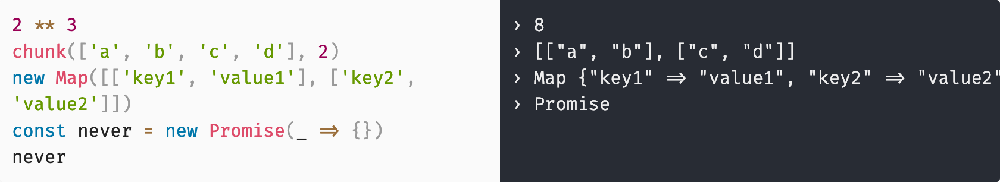

# react-livecode

> Experimental

Live code evaluating:

- Evaluate every expressions your typed, no need to use `console.log`.
- Inspect result side by side.
- Support modules (using `import`).



## Install

```
npm install react-livecode
```

## Usage

```js
import LiveCode from 'react-livecode'
import chunk from 'lodash/chunk'

render(
  <LiveCode
    scope={{chunk}}
    code={`
      2 ** 3
      chunk(['a', 'b', 'c', 'd'], 2)
    `}
  />
)
```

### `LiveCode` props

| Prop        | Type      | Default        | Description                                                                               |
| ----------- | --------- | -------------- | ----------------------------------------------------------------------------------------- |
| `scope`     | `Object`  | `{}`           | Scope variables                                                                           |
| `code`      | `string`  | `''`           | Code to evaluate                                                                          |
| `split`     | `string`  | `'horizontal'` | How to split editor and console, can be `horizontal` or `vertical`                        |
| `autoFocus` | `boolean` | `false`        | Auto focus editor                                                                         |
| `modules`   | `boolean` | `true`         | Enable using of [modules](https://developers.google.com/web/fundamentals/primers/modules) |

### Code highlighting

Import Prism styles to your page:

```js
import 'prismjs/themes/prism.css'
```

Or, load from external CDN:

```html
<link
  rel="stylesheet"
  href="https://unpkg.com/prismjs@1.15.0/themes/prism.css"
/>
```
